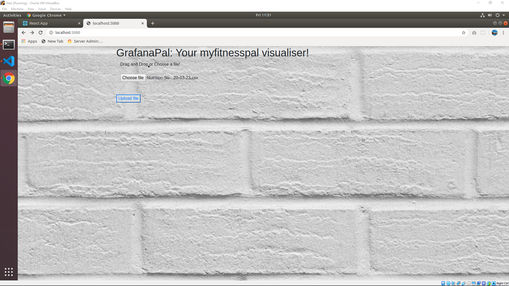
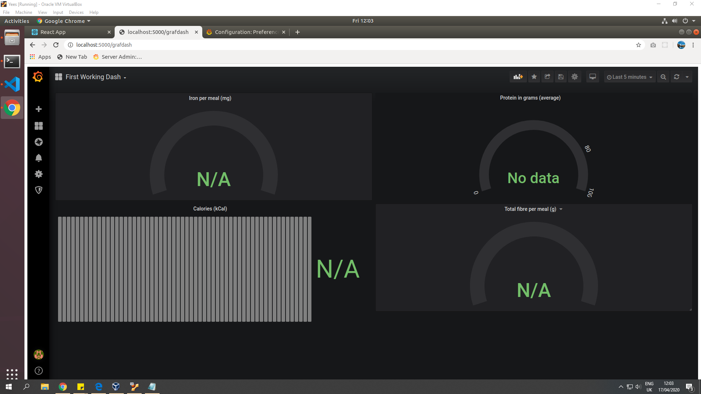
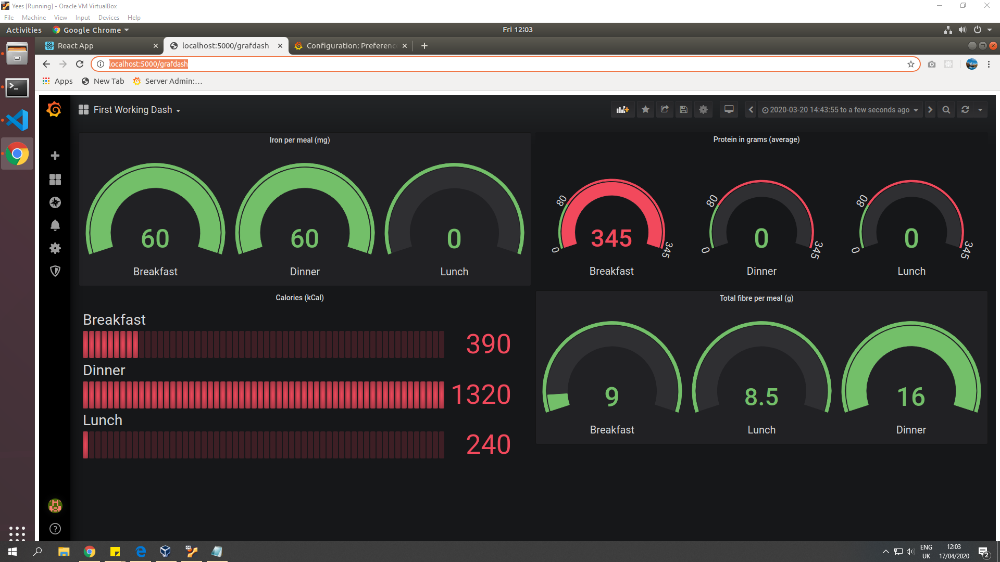

# GrafDashCSV
The repo for taking a csv file and visualising it with grafana!

# Building this app

Would not recommend doing this as the sql connection, the grafana iframe and other things are hardcoded to local host. 

~~Have not had the time to do a docker build either, might get around to it in the future!~~

Decided against doing this in the end. Read notes below.

# Screenshots
## Selecting the file

## File selected!

## Dashboard before file upload

## Dashboard after file upload

# About the app:

Built on flask, I'm using a webpage to take csv files from the user. Then, the app connects to the sql database, cleans out the data and puts it in a table 'mytable' 

This table is linked to grafana as a datasource, and can therefore be queried to visualise various things like average calories per meal and the breakdown of the nutrients.

# Final notes:
Decided to leave the project here as is as it was a very messy affair trying to get grafana to work well without compromising security/robustness.

As mentioned earlier, this project references local servers of grafana (and mysql) to do what could be done fairly easily using inbuilt python visualisation functions. So basically all this could be accomplished much easier and much more neatly using either a Jupyter Notebook, or just a pure flask app hosted on the web.

Being my first time using Grafana (and Flask!) it was quite a challenging but interesting time to make this work at all. Grafana seems like a very powerful utility and I saw a lot of people doing really cool stuff with it, but I think it is a bit overkill to just visualise food data- you don't need real time tracking and visualisation for that (grafana is designed for time series databases after all)

Flask is definitely very useful for when you want the polish of a website but the power of python behind the curtains!

Admittedly, the webpage itself doesn't look very nice- since I was pressed for time- but I think I can do a better job doing a standalone flask app for the same. Might get around to that in the future, help out the myfitness pal users a bit :D
The dataset also was pretty sparse (which is why the breakfast protein is so high on average lol) but I'm sure it'd look a whole lot better with real data.

### Built for GSoC 2020 by Anant Shukla!
